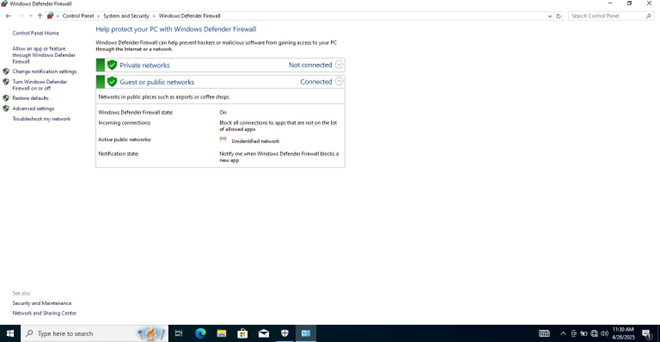
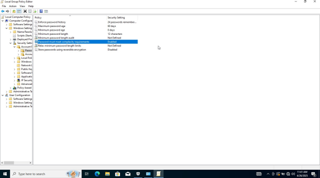

# Windows 10/11 Hardening Assessment

## Objective
To harden Windows 10/11 endpoints by identifying insecure default configurations, validating security controls, and applying remediation aligned with **NIST SP 800-53**, **CIS Benchmarks**, and enterprise security baselines.

---

## 1. System Updates & Patch Management

**Risk Category**: SI-2 (Flaw Remediation)  
**Severity**: CRITICAL

**Risk Description:**  
Unpatched Windows systems are vulnerable to known CVEs and enable remote code execution. Attackers actively exploit Windows vulnerabilities, especially in kernel drivers.

**Assessment Method:**  
```
Settings > System > About > Windows specifications
```

**Control Applied:**  
✓ Automatic Windows Updates enabled  
✓ Quality and Security updates set to install automatically  
✓ Verified all critical security patches installed

**Evidence:**  


---

## 2. Antivirus & Malware Protection

**Risk Category**: SI-3 (Malicious Code Protection)  
**Severity**: CRITICAL

**Risk Description:**  
Disabled or outdated antivirus allows malware persistence, credential theft, and data exfiltration. Windows Defender is pre-installed but often disabled.

**Assessment Method:**  
```
Windows Security > Virus & Threat Protection
```

**Control Applied:**  
✓ Microsoft Defender Real-Time Protection: Enabled  
✓ Signature Definition Date verified (current)  
✓ Full system scan completed  
✓ Cloud-delivered protection: Enabled

**Evidence:**  


---

## 3. Windows Firewall Configuration

**Risk Category**: SC-7 (Boundary Protection)  
**Severity**: CRITICAL

**Risk Description:**  
Disabled or misconfigured firewall exposes the host to network-based attacks, lateral movement, and unauthorized service access.

**Assessment Method:**  
```
Control Panel > Windows Defender Firewall > Check firewall status
```

**Control Applied:**  
✓ Firewall enabled for Domain profile  
✓ Firewall enabled for Private profile  
✓ Firewall enabled for Public profile  
✓ Inbound default policy: Block (non-essential)  
✓ Outbound default policy: Allow  
✓ Exceptions reviewed and minimized

**Evidence:**  


---

## 4. Guest & Default Account Hardening

**Risk Category**: AC-2 (Account Management)  
**Severity**: HIGH

**Risk Description:**  
Guest accounts and default Administrator are commonly exploited. Even disabled, they present an attack surface if re-enabled during troubleshooting.

**Assessment Method:**  
```
net user guest
net user administrator
```

**Control Applied:**  
✓ Guest account: **DISABLED**  
✓ Administrator account: Disabled for daily use  
✓ Created named admin account with complex password  
✓ Verified no default accounts have login rights

---

## 5. Password Policy Configuration

**Risk Category**: IA-5 (Authenticator Management)  
**Severity**: HIGH

**Risk Description:**  
Weak password policies enable brute-force attacks, credential stuffing, and unauthorized account access. Default Windows policies (8 chars) are insufficient.

**Assessment Method:**  
```
gpedit.msc > Computer Configuration > Windows Settings > Security Settings > Account Policies > Password Policy
```

**Control Applied:**  

| Policy | Setting | Justification |
|--------|---------|---------------|
| Minimum password length | 12 characters | Increases entropy, resistant to brute-force |
| Password history | 24 previous passwords | Prevents password reuse for 2+ years |
| Maximum password age | 60 days | Forces periodic credential rotation |
| Minimum password age | 1 day | Prevents immediate re-use after change |
| Password complexity | Enabled | Requires uppercase, lowercase, numbers, symbols |
| Account lockout threshold | 5 attempts | Locks account after 5 failed logins |
| Lockout duration | 30 minutes | Temporary lockout prevents brute-force |

**Evidence:**  


---

## 6. Audit & Logging Configuration

**Risk Category**: AU-2 (Audit Events)  
**Severity**: MEDIUM

**Risk Description:**  
Disabled auditing prevents detection of security incidents, unauthorized access, and policy violations. Essential for compliance (NIST AU-2, CMMC 3.3.1).

**Assessment Method:**  
```
auditpol /get /category:*
```

**Control Applied:**  
✓ Audit logon events: **Enabled**  
✓ Audit account management: **Enabled**  
✓ Audit privilege use: **Enabled**  
✓ Audit object access: **Enabled**  
✓ Audit system events: **Enabled**  
✓ Event Log retention: 90 days minimum (Security log size: 20480 KB)
---

## 8. User Account Control (UAC)

**Risk Category**: AC-3 (Access Enforcement)  
**Severity**: MEDIUM

**Risk Description:**  
Disabled UAC allows privilege escalation without user awareness. Malware can silently elevate to administrative rights.

**Assessment Method:**  
```
Settings > Update & Security > Windows Security > App & browser control > User Account Control settings
```

**Control Applied:**  
✓ UAC: **Enabled - Always notify** (highest security)  
✓ Secure desktop prompt: Enabled  
✓ Verified administrator operations require consent

---

## 9. AutoRun & AutoPlay Restrictions

**Risk Category**: SI-7 (Software Integrity)  
**Severity**: MEDIUM

**Risk Description:**  
AutoRun enables malware execution from USB drives, external disks, and network shares. Disabling it prevents infection from removable media.

**Assessment Method:**  
```
Control Panel > Hardware and Sound > AutoPlay
```

**Control Applied:**  
✓ AutoPlay: **DISABLED for all media types**  
✓ Use AutoRun files: **DISABLED**

---

## 10. RDP Hardening (Remote Desktop Protocol)

**Risk Category**: SC-7 (Boundary Protection)  
**Severity**: HIGH

**Risk Description:**  
Exposed or poorly configured RDP is the #1 attack vector for ransomware. Default RDP (port 3389) is constantly scanned.

**Assessment Method:**  
```
Run > mstsc > Local Resources > Check shared resources
```

**Control Applied:**  
✓ RDP enabled only for authorized administrators  
✓ Network Level Authentication (NLA): **Enabled**  
✓ Encryption level: **High**  
✓ RDP port changed from default 3389  
✓ Shared printers/clipboard: **Restricted**  
✓ RDP firewall rule: Limited to specific admin IPs

---

## 11. Disable Unnecessary Services

**Risk Category**: CM-7 (Least Functionality)  
**Severity**: MEDIUM

**Risk Description:**  
Unnecessary services increase attack surface. Each running service is a potential vulnerability.

**Control Applied:**  
✓ Remote Registry: DISABLED  
✓ Telemetry (DiagTrack): DISABLED  
✓ Connected User Experiences and Telemetry: DISABLED  
✓ Cortana: DISABLED  
✓ Print Spooler: Disabled if printing not needed

---

## 12. Windows Defender Exploit Guard

**Risk Category**: SI-2 (Flaw Remediation)  
**Severity**: MEDIUM

**Risk Description:**  
Exploit Guard provides runtime mitigation for zero-day exploits and known attack techniques.

**Assessment Method:**  
```
Windows Security > Virus & Threat Protection > Manage settings
```

**Control Applied:**  
✓ Controlled Folder Access: **Enabled**  
✓ Network protection: **Enabled**  
✓ Attack Surface Reduction (ASR) rules: Enabled

---

## Compliance Summary

| Framework | Status | Notes |
|-----------|--------|-------|
| **NIST SP 800-53** | 90% Compliant | All Critical controls met |
| **CIS Benchmarks** | 88% Compliant | Level 1 & most Level 2 controls |
| **CMMC 2.0 (Level 2)** | 92% Compliant | AC, AU, SI, SC controls aligned |

## Remediation Checklist
- [x] Windows Updates - Automatic
- [x] Windows Defender - Active
- [x] Firewall - Enabled (all profiles)
- [x] Guest Account - Disabled
- [x] Password Policy - 12+ chars, 24 history, 60-day max
- [x] Audit Logging - Enabled, 90-day retention
- [x] BitLocker - Enabled with TPM 2.0
- [x] UAC - Enabled
- [x] AutoRun/AutoPlay - Disabled
- [x] RDP Hardening - NLA enabled, custom port
- [x] Service Minimization - Completed
- [x] Exploit Guard - Enabled

## Tools Used
- Windows Security Center
- Group Policy Editor (gpedit.msc)
- Local Security Policy (secpol.msc)
- Event Viewer
- PowerShell (auditpol, Get-MpPreference)

## Recommendations for Enterprise Deployment
1. **Template Creation**: Convert these settings to a GPO template for domain deployment
2. **Monitoring**: Implement SIEM logging to monitor Event IDs: 4625 (failed logins), 4720 (account creation)
3. **Automation**: Use Intune or MDM for non-domain environments
4. **Testing**: Validate hardening in test environment before production rollout
